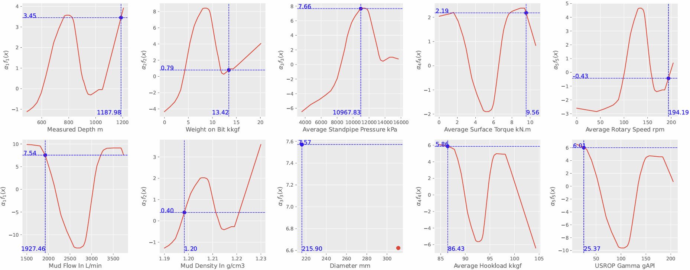

# Rate of Penetration Prediction using Explainable AI
## Running screenshots show
- **The Visualisation of a prediction derived by a learned NBM.**
- 
***
## Paper Support
- Original information: Stop Using Black-Box Models: Application of Explainable Artificial Intelligence for Rate of Penetration Prediction.
- Recruitment Journal: SPE Journal.
- Original DOI: https://doi.org/10.2118/223622-PA
***
## Description of the project
This research presents an explainable artificial intelligence approach for predicting Rate of Penetration (ROP) in drilling operations. Unlike traditional black-box models, our approach provides interpretable results while maintaining high prediction accuracy.
***
## Repository Structure
```
.
├── datasets/           # Contains processed dataset files
├── models/            # Model implementation (available upon request)
├── notebooks/         # Jupyter notebooks for analysis and visualization
main.py                 # main train script
```
***
## 🔧 Prerequisites
- Python 3.8 and above

***
## Dataset
The dataset is organized in the `./datasets` directory
